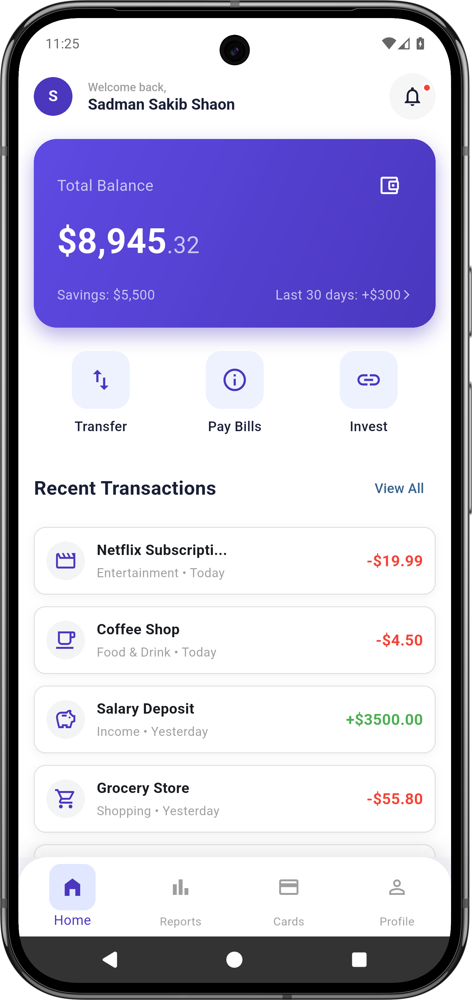
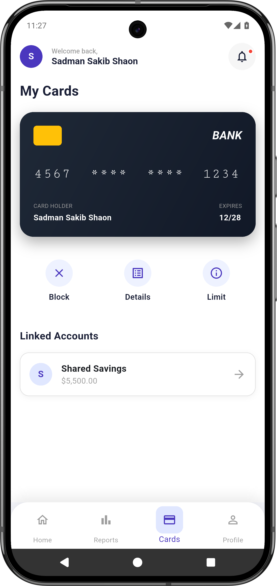
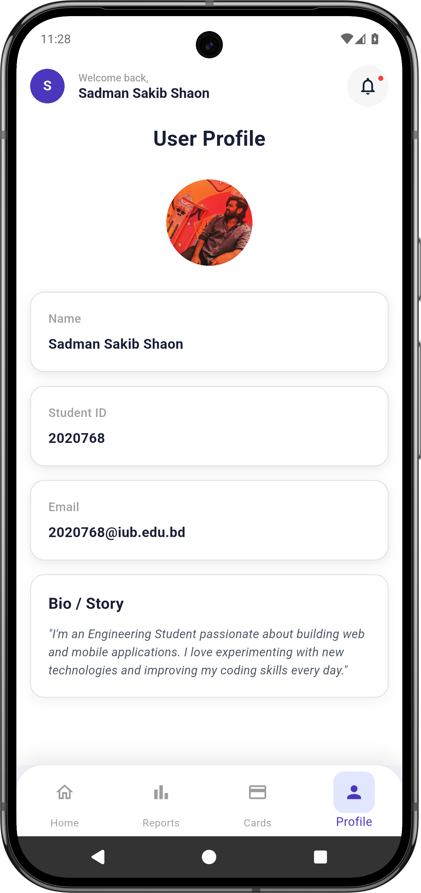

# Flutter UI

A premium, clean, and modern mobile banking UI implementation in Flutter. This project demonstrates a high-quality user interface with smooth animations, custom widgets, and a polished design system.

## 📱 UI Showcase

The application features four main screens, each designed with a focus on user experience and visual appeal.

| **Home Dashboard** | **Spending Reports** |
|:---:|:---:|
|  |  |
| *Balance overview, quick actions, and recent transactions* | *Detailed breakdown of monthly expenses with visual indicators* |

| **My Cards** | **User Profile** |
|:---:|:---:|
|  |  |
| *Card management, limits, and linked accounts* | *Personalized user profile with bio and settings* |

## ✨ Key Features

### **Design & UI**
- 🎨 **Premium Aesthetic:** Clean white backgrounds with subtle shadows and rounded corners
- 🌈 **Gradient Cards:** Beautiful purple gradient for balance card
- 📐 **Consistent Spacing:** Well-structured layout with proper padding and margins
- 🔘 **Custom Bottom Navigation:** Animated navigation bar with icon and label visibility

### **Components**
- 💳 **Balance Card:** Gradient card displaying total balance and savings
- 🎯 **Action Buttons:** Card-style buttons for Transfer, Pay Bills, and Invest
- 📊 **Transaction List:** Clean transaction items with category icons and color-coded amounts
- 🏠 **Custom AppBar:** Profile avatar, welcome message, and notification bell

### **Technical Highlights**
- ⚡ **Modular Architecture:** Widgets are well-organized and reusable
- 🎭 **Icon System:** Mix of Cupertino and Material icons for best visual experience
- 📱 **Responsive Layout:** Adapts to different screen sizes
- 🔄 **Smooth Animations:** Animated bottom navigation with color transitions

## 🛠️ Tech Stack

- **Framework:** [Flutter](https://flutter.dev/) ^3.9.2
- **Language:** [Dart](https://dart.dev/)
- **Icons:** Cupertino Icons + Material Icons
- **State Management:** StatelessWidget (Simple UI demo)

## 📂 Project Structure

```
lib/
├── main.dart                 # App entry point
├── screens/
│   ├── main_screen.dart     # Main container with navigation
│   ├── page1.dart           # Home dashboard
│   ├── page2.dart           # Reports page
│   ├── page3.dart           # Cards page
│   └── page4.dart           # Profile page
├── widgets/
│   ├── home_app_bar.dart           # Custom app bar
│   ├── custom_bottom_nav.dart      # Custom bottom navigation
│   ├── balance_card.dart           # Balance display card
│   ├── action_button.dart          # Action button widget
│   ├── home_action_buttons.dart    # Home action buttons row
│   ├── recent_transactions.dart    # Transaction list
│   ├── transaction_item.dart       # Single transaction item
│   └── ...                         # Other reusable widgets
└── theme/
    └── app_theme.dart        # App theme configuration
```

## 🚀 Getting Started

### Prerequisites
- Flutter SDK (^3.9.2 or higher)
- Dart SDK
- Android Studio / VS Code with Flutter extensions
- Android/iOS emulator or physical device

### Installation

1.  **Clone the repository:**
    ```bash
    git clone https://github.com/SadmanSS/assignment-two-flutter-UI-SADMAN_SAKIB_SHAON-2020768.git
    ```

2.  **Navigate to the project directory:**
    ```bash
    cd assignment-two-flutter-UI-SADMAN_SAKIB_SHAON-2020768
    ```

3.  **Install dependencies:**
    ```bash
    flutter pub get
    ```

4.  **Run the app:**
    ```bash
    flutter run
    ```

## 🎯 Features Implemented

- ✅ Custom Bottom Navigation with icons and labels
- ✅ Gradient Balance Card
- ✅ Action Buttons (Transfer, Pay Bills, Invest)
- ✅ Recent Transactions List
- ✅ Custom App Bar with user profile
- ✅ Clean white theme with purple accents
- ✅ Modular widget architecture
- ✅ Four main pages (Home, Reports, Cards, Profile)

## 🎨 Color Palette

- **Primary Purple:** `#4A37BE`
- **Light Purple:** `#5F4AE3`
- **Background Purple:** `#EEF2FF`
- **White:** `#FFFFFF`
- **Dark Text:** `#1A1F36`
- **Grey Text:** `Colors.grey`

## � Notes

- This is a **UI-only** implementation for demonstration purposes
- No backend integration or real data processing
- Perfect for learning Flutter UI development and widget composition
- All screenshots should be placed in the `ui_screenshot` folder

## 👨‍💻 Author

**Sadman Sakib Shaon**
- Email: 2020768@iub.edu.bd
- Student ID: 2020768

## �📄 License

This project is open source and available under the [MIT License](LICENSE).

---

Made with ❤️ using Flutter
